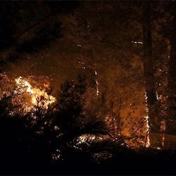
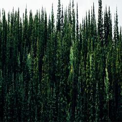

# Wildfire Image Classification

This Python script implements a convolutional neural network (CNN) to classify images into two categories: "Fire" and "No Fire." It is designed specifically to distinguish wildfire images from non-wildfire images. The model architecture consists of two variations, CNN1 and CNN2, which differ in their layer configurations. The choice between the two architectures depends on the desired input image size: 64x64 or 128x128.

## Prerequisites

- Python 3.x
- PyTorch
- Matplotlib
- PIL (Python Imaging Library)
- tqdm

## Usage

Ensure that you have Python installed on your system along with the required dependencies. Then, follow these steps to use the script:

1. **Command Syntax**:
   ```
   python main.py <model_type> <data_path> <model_path> [<show_image>]
   ```

   - `<model_type>`: Choose the model type (1 for 64x64, 2 for 128x128).
   - `<data_path>`: Path to the image data or directory.
   - `<model_path>`: Path to the pre-trained model.
   - `[<show_image>]`: (Optional) Boolean flag to specify whether to display the input image and prediction. Defaults to True.

2. **Example**:
   ```
   python main.py 1 data/images/fire.jpg saved_models/model_1.pth True
   ```

   This command will classify the image `fire.jpg` using the model specified by `model_1.pth` located in the directory `saved_models/`. The script will display the input image along with the predicted class (Fire or No Fire).

## Custom Dataset

The script utilizes a custom dataset class (`CustomDataset`) to load images from the specified data directory. Images are transformed using `transforms.Compose` to resize them to the required dimensions and convert them to PyTorch tensors.

## Model Architectures

- **CNN1**:
  - Input: 64x64 RGB images
  - Architecture:
    - Three convolutional layers followed by max-pooling
    - Two fully connected layers
  - Dropout layers are included to prevent overfitting.
  - Accuracy: 95% for the V2_1 (but mistakes orange sunrises for fires)
  - Accuracy: 91% for the V2_2 (more resistant)

- **CNN2**:
  - Input: 128x128 RGB images
  - Architecture:
    - Similar to CNN1 but with deeper fully connected layers
    - Dropout layers included for regularization
  - Accuracy: 90% for the V3_0

## Notes

- Ensure that the model type specified during execution matches the architecture used during training.
- If the model fails to load, verify that the provided model path is correct and that the file exists.

## Examples:


